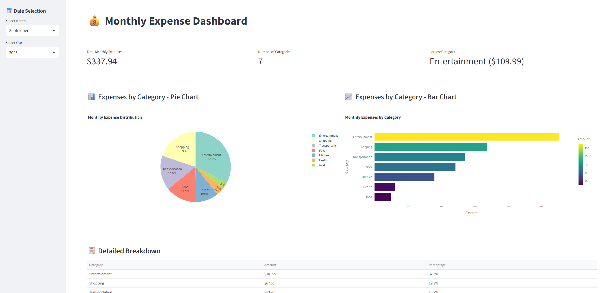

# FastMCP Demo Server

A demonstration MCP server for expense management built with FastMCP (Model Context Protocol). This server provides tools and resources for tracking, categorizing, and managing personal or business expenses.

## Demo

Here's a demo video showing the FastMCP server in action:
[Demo_mcp](https://github.com/user-attachments/assets/a9a31319-fc02-437a-99b5-47f85a08131f)

## Installation

```bash
pip install uv
uv init .

uv sync
```

## Usage

We are using [FASTMCP](https://github.com/jlowin/fastmcp) server for creating the server.

To test the server and its feature
```bash
uv run fastmcp dev main.py
```

To install the server with your Host(llm--> Claude-desktop, ChatGPT, Gemini)

```bash
uv run fastmcp install claude-desktop main.py
```

## Features

### Core Functionality
- **Expense Tracking**: Add, update, and delete expense records
- **Category Management**: Organize expenses by custom categories  
- **Reporting**: Generate expense reports and summaries
- **Data Persistence**: Store expense data with proper validation
- **Real-time Updates**: Instant synchronization of expense changes

### Visual Dashboard
You can also visually track the expenses on expense board created using [Streamlit](https://streamlit.io/)



